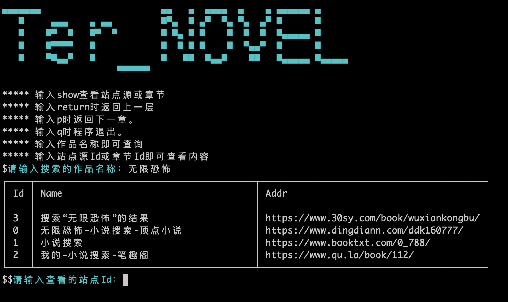

```
▄▄▄▄▄▄▄                      ▄▄   ▄  ▄▄▄▄  ▄    ▄ ▄▄▄▄▄▄ ▄     
   █     ▄▄▄    ▄ ▄▄         █▀▄  █ ▄▀  ▀▄ ▀▄  ▄▀ █      █     
   █    █▀  █   █▀  ▀        █ █▄ █ █    █  █  █  █▄▄▄▄▄ █     
   █    █▀▀▀▀   █            █  █ █ █    █  ▀▄▄▀  █      █     
   █    ▀█▄▄▀   █            █   ██  █▄▄█    ██   █▄▄▄▄▄ █▄▄▄▄▄
```

### 1.终端小说阅读器

提交检索的小说名称后，通过colly请求爬取设置在`config.SiteUrl`的站点，使用表格输出站点源以及章节。再通过输入对于选择阅读的站点源或章节Id在终端阅读小说！

### 2.如何使用

直接运行代码（需要本地安装了go语言环境)
```shell script
git clone https://github.com/zilvzhong/ter_novel.git
cd ter_novel
go run main.go
```

或使用release目录下编译好的`Mac、Win、Linux、`的二进制包
```shell script
cd ter_novel/release
chmod +x ter_novel.mac
./ter_novel

对应的编译语句
CGO_ENABLED=0 GOOS=darwin GOARCH=amd64 go build -o ./release/ter_novel.mac
CGO_ENABLED=0 GOOS=windows GOARCH=amd64 go build -o ./release/ter_novel.exe
CGO_ENABLED=0 GOOS=linux GOARCH=amd64 go build  -o ./release/ter_novel.linux
```

### 2.使用说明

程序运行后直接输入需要查看的小说名称，如图


